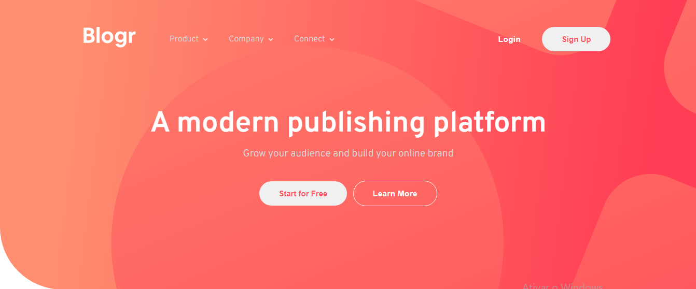
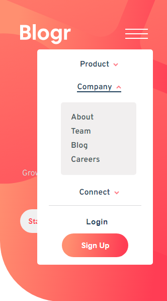

# Blogr landing page
Desafio de JS intermediário para criação de um formulário com validação

<h2 align="center">🔗 Link da página</h2>

Abaixo temos o link da página para visualização e testes:

👉 <a href="https://marvin1423.github.io/form-validation/" target="_blank">Blogr ⚔</a>

#

 
 <h2>🕹️ Tecnologias Utilizadas</h2>
    <ul align="center">
        
        
        
  
      
<h3>Criação de Landing page</h3>
<h3>Posicionamento de elementos no CSS</h3>
<h3>Menu hamburguer com javascript</h3>
    </ul>

#

<h2 align="center">📐 Página Responsiva ✂️</h2>

O projeto apresenta responsividade na navegação dos principais dispositivos:

<ul>
    <li>Desktop 🖥️</li>
    <li>Tablet 💻</li>
    <li>Smartphone 📱</li>
</ul>

